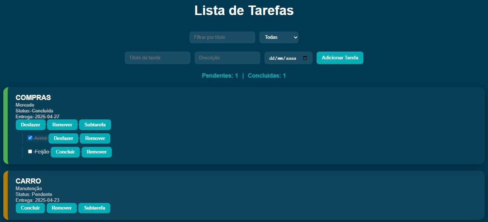

# Qual foi sua lógica para estruturar o projeto?
1. Estrutura HTML:
    Criei uma estrutura simples e semântica para facilitar a leitura e a manipulação via JavaScript.
    Cada tarefa é representada como um "card" individual, contendo título, descrição, status, data de entrega  e botões de ação.
    Subtarefas são adicionadas dinamicamente dentro de cada tarefa, com um estilo indentado.

2. Estilo com CSS:
    Usei border-left colorido para indicar visualmente o status da tarefa:
    Vermelho: atrasada
    Verde: concluída
    Laranja (padrão): pendente

3.  Lógica JavaScript:
    Centralizei todos os dados em um array de objetos (tarefas).
    Utilizei o LocalStorage para guardar as informações adicionados nas listas.
    
    Criei funções para:
    Adicionar/remover tarefas e subtarefas
    Marcar como concluída ou pendente
    Detectar atraso comparando a data da entrega com a data atual
    Também incluí filtros dinâmicos por status e título, atualizando a lista em tempo real conforme o usuário digita.

---

# Que parte você achou mais difícil ou travou?
1. CSS:
    Minha maior dificuldade com css e criar layouts onde tenho que usar minha imaginação,
   pois perco um certo tempo sempre tentando buscar o melhor.

3. JavaScript:
    A parte que achei mais difícil foi montar a lógica em JavaScript para adicionar, remover e editar as tarefas corretamente,
    sem quebrar o layout. Me confundi um   pouco com os eventos e como manipular os elementos do DOM.

---

# O que faria diferente se tivesse mais tempo?
    Com certeza, mudaria o layout. Acabei gastando um tempo precioso tentando encontrar o melhor visual 
    e, no final, usei um modelo mais genérico.

    Também ajustaria o tamanho dos botões, pois achei que ficaram muito grandes.
    Nos botões das subtarefas, usaria apenas os ícones de ✅ e ❌, 
    para deixá-los mais simples e intuitivos.

    Por fim, no campo de status, colocaria um ícone colorido representando o estado da tarefa — 
    por exemplo: amarelo para "em andamento", vermelho para "pendente" e verde para "concluído".

---

# O que faria diferente se fosse para um cliente real?
    Se fosse um projeto para um cliente real, eu priorizaria uma entrega mais profissional 
    desde o início. 
    Teria investido mais tempo em planejar o layout com base em referências visuais claras, 
    para não desperdiçar tempo tentando imaginar o design na hora.

    Também tomaria mais cuidado com a usabilidade, deixando os botões mais ajustados ao tamanho
    ideal e utilizando ícones mais intuitivos, 
    como ✅ e ❌ para ações simples. Além disso, aplicaria um sistema de status mais visual, 
    com cores (amarelo, vermelho e verde) para facilitar a identificação rápida da situação de cada tarefa.

    E, principalmente, validaria os requisitos com o "cliente" antes de começar — 
    para garantir que as funcionalidades e a aparência estivessem alinhadas com as expectativas dele.

---

# Você usou alguma ferramenta ou inteligência artificial para ajudar? Como?
    Sim, usei uma inteligência artificial para tirar dúvidas de programação, 
    revisar textos e obter sugestões de melhorias no layout e na lógica do código. 
    Ela me ajudou a economizar tempo e resolver problemas mais rápido.

  

